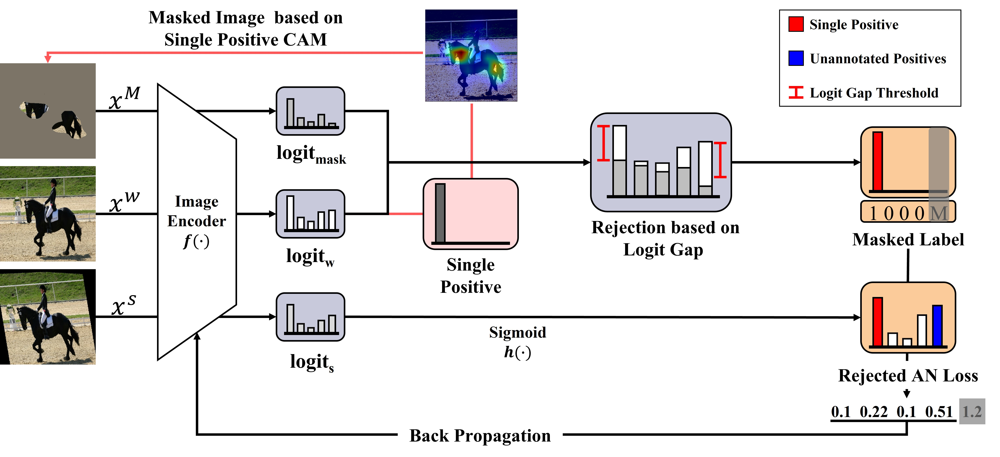
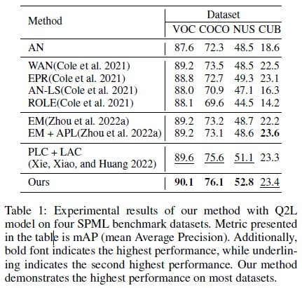

# CAM based Loss Rejection for Multi-Label Learning with Single Positive Labels (AAAI 2024, under review)

# Overview

# Abstract
Multi-label classification is a task that categorizes all classes of objects present in an image. Because real-world images typically consist of multiple objects, multi-label classification is a highly practical task. However, due to the high costs associated with data labeling, constructing a fully labeled dataset can be challenging. As a result, various methods are being researched to perform multi-label learning with only partially annotated labels. Single Positive Multi-Label Learning is a task that each image is provided with only one positive label. Most approach in Single Positive Multi-Label Learning (SPML) is to treat unannotated labels as negatives (“Assumed Negative”, AN). However, this assumption leads to some actual positive labels being incorrectly regarded as negative, resulting in false negatives. These false negatives degrade model generalization. Therefore, treating false negatives is the most important in AN. Previous approaches identify false negatives through assumed negatives that the model learned incorrectly. In contrast, we establish a criterion for identifying false negatives based on the Class Activation Map (CAM) of the given single positive that the model has learned confidently. Our criterion is constructed based on the logit gap between the highlighted area of the Single Positive CAM and the original image. Using this criterion, we propose a rejection method to reject the identified false negatives from the model training process. In this paper, we evaluate our method on four datasets: Pascal VOC 2012, MS COCO, NUSWIDE, and CUB. When compared to the previous state-of-the-art methods in Single Positive Multi-label Learning, our method achieves performance improvement and state-of-the-art performance on most of the datasets.

# Experimental Results

# Acknowledgements
Our code is built on the following repositories
* [Multi-Label Learning from Single Positive Labels](https://github.com/elijahcole/single-positive-multi-label)
* [Large Loss Matters in Weakly Supervised Multi-Label Classification ](https://github.com/snucml/LargeLossMatters)
* [Query2Label: A Simple Transformer Way to Multi-Label Classification](https://github.com/SlongLiu/query2labels)